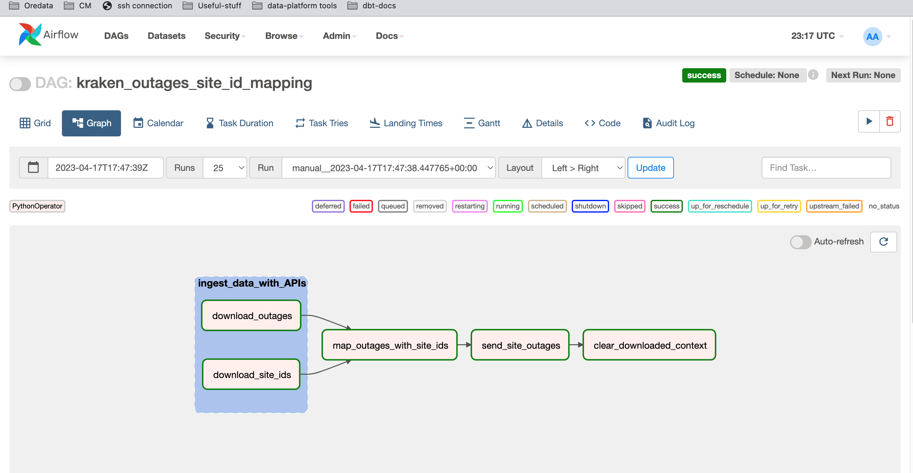
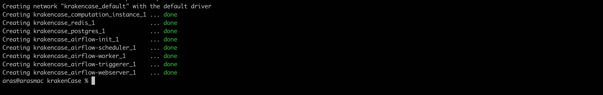
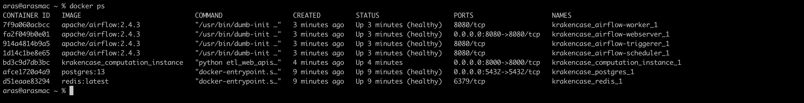
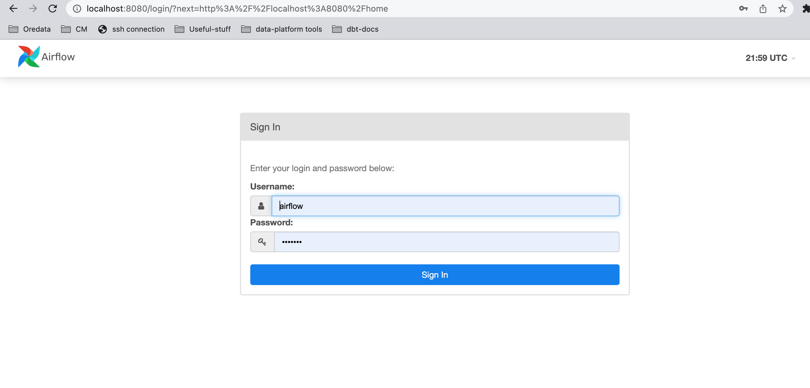
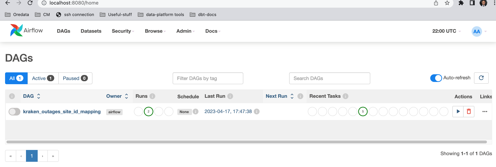
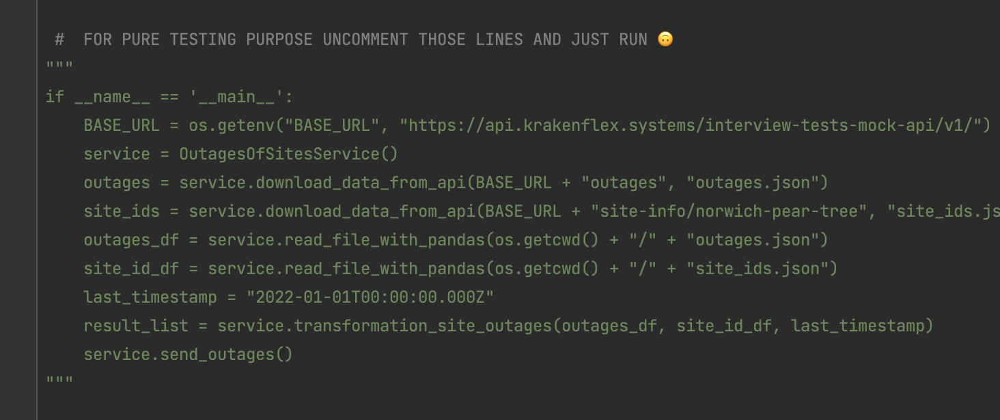

## Requirements
* Docker
* docker-compose
* python3
* pip

## Getting Started
here is main idea of logic picture
* orchestrator is airflow (visualize logic)
* computation on seperated environment that is fast API with pandas library (ingest,mapping and loading logics purpose)


I thought that we might need an orchestrator to handle the ingest, transformation, and load processes. However, I believe that the orchestrator and computation need to be separated. For example, we might have one ETL logic here, but let's say we have 50-100 pipelines. If we do ingest and transformation in the orchestrator, 
it will cause an excessive workload and might cause delays in our processes. Therefore, we need a different container called computation_service, and the orchestrator should only handle management tasks while mapping and load processes should be in a different place. Computation_instance uses FastAPI lightweight web framework via http request to process incoming tasks step by step.


We have multiple chances to run this logic. Basically, we can run the code blocks independently of the environment by putting them into Docker containers.

#### First Solution:
  ```bash
  docker-compose up airflow-init
  ```
after completed pre-requisite for orchestrator run second command;
  ```bash
 docker-compose up -d
  ```
when you run this command,you should saw on CLI



maybe you want to check what is health status for containers;



after we saw health status for whole containers open web browser go to [http://localhost:8080/](http://localhost:8080/)
(based on local env. webserver may not response in a second :) maybe you can check krakencase_webserver_1 container logs for review succeed log but eventually ıt will response  from my experience it will take 1.5 minute :/ )

after yo go to web server you should see



Username :`airflow` \
password : `airflow`

after we logged in orchetrator we should see ETL logic for outage site id logic and based on our requirement with airflow we can schedule our ETL logic for testing purpose default schedule is None, we can trigger manually by clicking __play__ icon on left side



The goal here is to provide the necessary dependencies by requesting the desired APIs. In any case, corner cases may occur, such as outages or site-id APIs returning a 500 internal server error, but in fact, they are two APIs that are dependent on each other because a mapping needs to be made by pulling the relevant batteries from the site-id response based on the response coming from outages. If either of them fails, the other API needs to wait for the failing API to retry it once more (retry policy).

As another corner case, it would be good to dynamically provide the current timestamp from the last request made, because sending the same data as a request to the third API due to the mapped responses can cause duplicates. 
#### Second Solution:
We can call this solution a lightweight one. We can execute the process as a script using only the OutagesOfSitesService class

Go to OutagesOfSitesService class uncomment code block that you see bottom picture that you see



and if we think there are too many dependency sources as in the first solution, we can simply run the service purely. 
install dependen libraries
  ```bash
 pip install -r requirements.txt
  ```
run 
  ```bash
 python OutagesOfSitesService.py
  ```
in any case if dockerized solution doesn't work we can run OutagedSiteIDservice this kind of solution will provide us another advantage of running out logic maybe we dont want to orchestrate(If Docker containers are too much overengineering.) this logic or maybe it is just triggered based solution that we may not schedule every time and if we import this script to cloud 
in this can be an AWS lambda function or a Google Cloud function where we import  the service, but for the local testing process here;


###### Unit Tests

  ```bash
   pip install -r requirements.txt
   python tests.py
  ```

